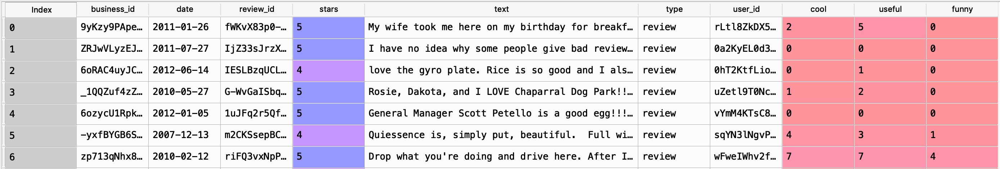

# Sentiment Analysis for Yelp Restaurant Reviews
Sentiment Analysis for Restaurant Reviews.
### Pre-requisite Libraries:
* Python 3.6
* Scikit-Learn
* NLTK
* Pandas

### Dataset
[10k Yelp Restaurant Reviews Dataset](https://www.dropbox.com/s/wc6rzl1a2os721d/yelp.csv?dl=0)



### NLTK (Natural Language Toolkit)
**NLTK(Natural Language Toolkit)** in python has a list of stopwords stored in 16 different languages.

#### Stopwords:

One of the major forms of pre-processing is to filter out useless data. In natural language processing, useless words (data), are referred to as stop words.

**Stop Words:** A stopword is a commonly used word (such as “the”, “a”, “an”, “in”) that a search engine has been programmed to ignore, both when indexing entries for searching and when retrieving them as the result of a search query.


To check the list of stopwords you can type the following commands in the python shell:
```
import nltk
from nltk.corpus import stopwords
set(stopwords.words('english'))
```


